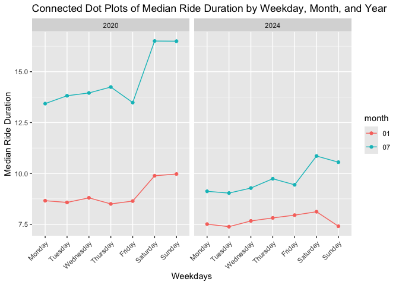

p8105_hw3_lr3257
================
Leonor Rui
2024-10-06

# Homework 3

## Problem 1

### Description:

The ny_noaa dataset has 2595176 observations and 7 variables. Key
variables include date (categorical, date of the weather), prcp
(numeric, precipitation in millimeters), snow (numeric, 24-hr snowfall
in centimeters), snwd (numeric, accumulated snow depth in inches), tmax
(numeric, maximal temperature), tmin(numeric, minimum temperature).

``` r
na_counts <- sapply(ny_noaa, function(x) sum(is.na(x)))
na_counts
```

    ##      id    date    prcp    snow    snwd    tmax    tmin 
    ##       0       0  145838  381221  591786 1134358 1134420

As the numbers above shows, quite a large proportion of the observations
in this dataset contains NA values, especially for the tmax and tmin
variables. These missing values would be a problem for future data
analysis, and we should find a way to avoid it.

- Do some data cleaning. Create separate variables for year, month, and
  day. Ensure observations for temperature, precipitation, and snowfall
  are given in reasonable units. For snowfall, what are the most
  commonly observed values? Why?

``` r
ny_df = ny_noaa |>
  drop_na(tmin, tmax) |>
  mutate(
    date = as.character(date),
    tmin = as.numeric(tmin),
    tmax = as.numeric(tmax),
    tmin = tmin / 10,
    tmax = tmax / 10
  ) |>
  separate(date, into = c("year", "month", "day"), sep = "-")
print(ny_df, n=10)
```

    ## # A tibble: 1,458,900 × 9
    ##    id          year  month day    prcp  snow  snwd  tmax  tmin
    ##    <chr>       <chr> <chr> <chr> <int> <int> <int> <dbl> <dbl>
    ##  1 USC00300023 1981  01    03        0     0     0 -12.2 -20.6
    ##  2 USC00300023 1981  01    05        0     0     0  -5.6 -17.8
    ##  3 USC00300023 1981  01    12        0     0     0 -12.2 -30.6
    ##  4 USC00300023 1981  01    13        0     0     0  -6.7 -28.9
    ##  5 USC00300023 1981  01    15        0     0     0  -5   -10.6
    ##  6 USC00300023 1981  01    17        0     0     0  -1.1 -15  
    ##  7 USC00300023 1981  01    20        0     0     0   6.1  -6.7
    ##  8 USC00300023 1981  01    21        0     0     0   1.7 -10.6
    ##  9 USC00300023 1981  01    22        0     0     0   0.6  -5  
    ## 10 USC00300023 1981  01    23      117   127    76   2.2  -4.4
    ## # ℹ 1,458,890 more rows

``` r
snow_table = ny_df |>
  pull(snow) |>
  table() 

snow_mode = names(sort(snow_table, decreasing = TRUE))[1]
```

The most commonly observed value for snow is 0, since there is no snow
for most times of the year.

- Make a two-panel plot showing the average max temperature in January
  and in July in each station across years. Is there any observable /
  interpretable structure? Any outliers?

``` r
ny_df |>
  filter(month %in% c("01", "07")) |>
  group_by(year, month, id) |>
  summarize(mean_tmax = mean(tmax)) |>
  ggplot(aes(x = year, y = mean_tmax)) +
  geom_boxplot() +
  facet_grid(.~month) +
  labs(
    title = "Monthly Average Maximum Temperature in January and July" ,
    x = "year",
    y = "Average Max Temperature"
  ) +
  theme(aspect.ratio = 1/2) +
  theme(axis.text.x = element_text(angle = 45, vjust = 1, hjust = 1))
```

    ## `summarise()` has grouped output by 'year', 'month'. You can override using the
    ## `.groups` argument.

<!-- -->

The average max temperature in Januray generally has a positively skewed
distribution across different years, meaning there were often some
relatively warm days in January. In 1982 and 2005, there are 2
noticeable negative outliers that are below -10 Fahrenheit Conversely,
the average max temperature in July generally has a negatively skewed
distribution across the years, meaning there were often some relatively
cool days in July. There is one quite extreme outlier in 1988, which
represents the mean tmax of the station lower than 15 Fahrenheit, a very
cold July.

- Make a two-panel plot showing (i) tmax vs tmin for the full dataset
  (note that a scatterplot may not be the best option); and (ii) make a
  plot showing the distribution of snowfall values greater than 0 and
  less than 100 separately by year.

``` r
tmin_tmax = ny_df |>
  ggplot(aes(x = tmin, y = tmax)) +
  geom_hex() +
  labs(
    title = "Hex Plot of Maximum vs. Minimum Temperatures",
    x = "Minimum Temperature (°F)",
    y = "Maximum Temperature (°F)"
  )

snowfall = ny_df |>
  filter(snow > 0, snow < 100) |>
  group_by(year) |>
  ggplot(aes(x = snow, y = year)) +
  geom_density_ridges() +
  labs(
    title = "Density Plots of Snowfall (0~100) by Year",
    x = "Snowfall Depth (cm)",
    y = "year"
  )

(tmin_tmax + snowfall) +
  plot_layout(ncol = 2, widths = c(1, 1))
```

    ## Picking joint bandwidth of 4.16

<!-- -->

## Problem 2

read in datasets

``` r
demographic_df = read_csv("data/nhanes_covar.csv", skip = 4) |>
  janitor::clean_names()
```

    ## Rows: 250 Columns: 5
    ## ── Column specification ────────────────────────────────────────────────────────
    ## Delimiter: ","
    ## dbl (5): SEQN, sex, age, BMI, education
    ## 
    ## ℹ Use `spec()` to retrieve the full column specification for this data.
    ## ℹ Specify the column types or set `show_col_types = FALSE` to quiet this message.

``` r
accelerometer_df = read_csv("data/nhanes_accel.csv") |>
  janitor::clean_names()
```

    ## Rows: 250 Columns: 1441
    ## ── Column specification ────────────────────────────────────────────────────────
    ## Delimiter: ","
    ## dbl (1441): SEQN, min1, min2, min3, min4, min5, min6, min7, min8, min9, min1...
    ## 
    ## ℹ Use `spec()` to retrieve the full column specification for this data.
    ## ℹ Specify the column types or set `show_col_types = FALSE` to quiet this message.

organize datasets

``` r
full_acc_df = 
  left_join(demographic_df, accelerometer_df, by = "seqn") |>
  filter(age >= 21) |>
  drop_na(sex, age, bmi, education) |>
  mutate(
    sex = fct_recode(as.factor(sex), Male = "1", Female = "2"),
    education = fct_recode(as.factor(education), "less than high school" = "1", 
                           "high school equivalent" = "2", "more than high school" = "3")
  )
```

- Produce a reader-friendly table for the number of men and women in
  each education category, and create a visualization of the age
  distributions for men and women in each education category. Comment on
  these items.

``` r
full_acc_df |>
  group_by(sex, education) |>
  summarize(count = n()) |>
  pivot_wider(
    names_from = education,
    values_from = count
  ) |>
  knitr::kable() 
```

    ## `summarise()` has grouped output by 'sex'. You can override using the `.groups`
    ## argument.

| sex    | less than high school | high school equivalent | more than high school |
|:-------|----------------------:|-----------------------:|----------------------:|
| Male   |                    27 |                     35 |                    56 |
| Female |                    28 |                     23 |                    59 |

``` r
full_acc_df |>
  ggplot(aes(x = age, y = sex)) +
  facet_grid(education~.) +
  geom_density_ridges() +
  labs(
    title = "Density Ridges Plots of Age Distribution for Men and Women in Each Education Category"
  )
```

    ## Picking joint bandwidth of 7.91
    ## Picking joint bandwidth of 9.03
    ## Picking joint bandwidth of 7.15

<!-- -->

From the table, we can see that there are more participants with “more
than high school” diploma than other diplomas for both male and female,
and there are more males with “high school equivalent” diploma than
female. From the distribution plots, we can get a clearer vision that
the distributions for females with “less than high school” and “high
school equivalent” diplomas are relatively left skewed, meaning more
elder women have lower diplomas than men of the same age. However, for
the “more than high school” diploma, the distribution for female is
strongly right skewed, showing how more and more women are getting
college degrees in recent years. For males, all three education
distributions tend to show a slightly bimodal shape.

- Traditional analyses of accelerometer data focus on the total activity
  over the day. Using your tidied dataset, aggregate across minutes to
  create a total activity variable for each participant. Plot these
  total activities (y-axis) against age (x-axis); your plot should
  compare men to women and have separate panels for each education
  level. Include a trend line or a smooth to illustrate differences.
  Comment on your plot.

``` r
full_acc_df |>
  mutate(
    total_acc = rowSums(across(6:ncol(full_acc_df)), na.rm = TRUE)) |>
  relocate(seqn, total_acc) |>
  ggplot(aes(x = age, y = total_acc, color = sex)) +
  facet_grid(education~.) +
  geom_point() +
  geom_smooth(se = FALSE) +
  labs(
    title = "Scatterplots of Age vs. Total Accelerometer Activity by Sex and Education Level",
    y = "total accelerometer activity"
  )
```

    ## `geom_smooth()` using method = 'loess' and formula = 'y ~ x'

<!-- -->

From these plots, we can see that 1. The 24h accelerometer activity is
generally higher for female than for male, with the exception of elder
males with “less than high school” education level, who have higher
activity than females of the same condition. 2. Elder people tend to
have lower 24h accelerometer activity than young people. 3. For people
with “more than high school” diploma, their accelerometer activity is
relatively stable across lifespan.

- Accelerometer data allows the inspection activity over the course of
  the day. Make a three-panel plot that shows the 24-hour activity time
  courses for each education level and use color to indicate sex.
  Describe in words any patterns or conclusions you can make based on
  this graph; including smooth trends may help identify differences.

``` r
full_acc_df |>
  pivot_longer(
    cols = min1:min1440,
    names_to = "minute",
    values_to = "MIMS",
    names_prefix = "min"
  ) |>
  mutate(
    minute = as.numeric(minute),
    hour = floor(minute/60)
  ) |>
  group_by(seqn, hour, education, sex) |>
  summarise(MIMS_hour = sum(MIMS)) |>
  ggplot(aes(x = hour, y = MIMS_hour, color = sex)) +
  facet_grid(education~.) +
  geom_point() +
  geom_smooth(se = FALSE) +
  labs(
    title = "24-Hour Activity by Education Level and Sex",
    x = "Hour of the Day",
    y = "Total MIMS per Hour"
  ) 
```

    ## `summarise()` has grouped output by 'seqn', 'hour', 'education'. You can
    ## override using the `.groups` argument.
    ## `geom_smooth()` using method = 'gam' and formula = 'y ~ s(x, bs = "cs")'

<!-- --> The
24-hour accelerometer activity is very similar cross the education
groups and between male and female, with the activity of females
slightly higher than males with “more than high school” diploma. Within
all 6 combinations of conditions, the activity is higher during daytime
(hour 8 - 20) that that during nighttime.

## Problem 3

Import and clean data

``` r
Jan_2020_df = read_csv("data/citibike/Jan 2020 Citi.csv", show_col_types = FALSE) |>
  janitor::clean_names() |>
  mutate(
    month_year = "01/2020"
  )

July_2020_df = read_csv("data/citibike/July 2020 Citi.csv", show_col_types = FALSE) |>
  janitor::clean_names() |>
  mutate(
    month_year = "07/2020"
  )

Jan_2024_df = read_csv("data/citibike/Jan 2024 Citi.csv", show_col_types = FALSE) |>
  janitor::clean_names() |>
  mutate(
    month_year = "01/2024"
  )

July_2024_df = read_csv("data/citibike/July 2024 Citi.csv", show_col_types = FALSE) |>
  janitor::clean_names() |>
  mutate(
    month_year = "07/2024"
  )

citibike_df = bind_rows(Jan_2020_df, July_2020_df, Jan_2024_df, July_2024_df) |>
  mutate(
    month_year = as.factor(month_year),
    rideable_type = as.factor(rideable_type),
    weekdays = as.factor(weekdays),
    member_casual = as.factor(member_casual)
  )
```

### Description:

The combined citibike dataset has 99485 observations and 8 variables.
There is 1 more variable than the original dataset since I added the
variable “month_year” for clarification. To make analysis easier, I also
changed some character variables into factor variables. There are 4
factor variables in the dataset: rideable_type, weekdays, member_casual,
month_year; 3 character variables: rider_id, start_station_name,
end_station_name; and 1 numeric variable: duration.

- Produce a reader-friendly table showing the total number of rides in
  each combination of year and month separating casual riders and Citi
  Bike members. Comment on these results.

``` r
citibike_df |>
  group_by(member_casual, month_year) |>
  summarise(count = n()) |>
  pivot_wider(
    names_from = member_casual,
    values_from = count
  ) |>
  knitr::kable()
```

    ## `summarise()` has grouped output by 'member_casual'. You can override using the
    ## `.groups` argument.

| month_year | casual | member |
|:-----------|-------:|-------:|
| 01/2020    |    984 |  11436 |
| 01/2024    |   2108 |  16753 |
| 07/2020    |   5637 |  15411 |
| 07/2024    |  10894 |  36262 |

From the table, we can see that the numbers of both casual and member
users are increasing from 2020 to 2024. There are also much more people
who use the bike during July than during January, perhaps because of
weather issues. Noticeably, the difference (in terms of times) of bike
usage between July and January for members is not as big as that for
casual users, maybe because those who have paid for membership think
they should use the bike more regardless of the weather.

- Make a table showing the 5 most popular starting stations for July
  2024; include the number of rides originating from these stations.

``` r
July_2024_df |>
  group_by(start_station_name) |>
  summarise(count = n()) |>
  arrange(desc(count)) |>
  slice(1:5) |>
  knitr::kable()
```

| start_station_name       | count |
|:-------------------------|------:|
| Pier 61 at Chelsea Piers |   163 |
| University Pl & E 14 St  |   155 |
| W 21 St & 6 Ave          |   152 |
| West St & Chambers St    |   150 |
| W 31 St & 7 Ave          |   146 |

- Make a plot to investigate the effects of day of the week, month, and
  year on median ride duration. This plot can include one or more
  panels, but should facilitate comparison across all variables of
  interest. Comment on your observations from this plot.

``` r
citibike_df |>
  separate(col = month_year, into = c("month", "year"), sep = "/") |>
  mutate(
    month = as.factor(month),
    year = as.factor(year),
    weekdays = factor(weekdays, levels = c("Monday", "Tuesday", "Wednesday", "Thursday", "Friday", "Saturday", "Sunday"))) |>
  arrange(weekdays) |>
  group_by(weekdays, month, year) |>
  summarise(median_duration = median(duration)) |>
  ggplot(aes(x = weekdays, y = median_duration, color = month, group = month)) +
  geom_point() +
  geom_line() +
  facet_grid(.~year) +
  labs(
    title = "Connected Dot Plots of Median Ride Duration by Weekday, Month, and Year",
    y = "Median Ride Duration",
    x = "Weekdays"
  ) +
  theme(axis.text.x = element_text(angle = 45, vjust = 1, hjust = 1))
```

    ## `summarise()` has grouped output by 'weekdays', 'month'. You can override using
    ## the `.groups` argument.

<!-- -->

This plot shows clearly that people tend to ride for a shorter time in
January than in July, perhaps of weather concerns. In addition, the
median ride duration decreases from 2020 to 2024 for both months, which
could be due to the more frequent usages of citibikes for convinient
short distance rides.

- There were relatively few electric Citi Bikes in 2020, but many more
  are available now. For data in 2024, make a figure that shows the
  impact of month, membership status, and bike type on the distribution
  of ride duration. Comment on your results.

``` r
citibike_df |>
  separate(col = month_year, into = c("month", "year"), sep = "/") |>
  mutate(
    month = as.factor(month),
    year = as.factor(year)
  ) |>
  group_by(month, rideable_type, member_casual) |>
  ggplot(aes(x = duration, y = month, fill = member_casual)) +
  geom_density_ridges(alpha = .3) +
  facet_grid(rideable_type~.) +
  labs(
    title = "Density Ridge Plots of Ride Duration by Month, Membership, and Bike Type"
  )
```

    ## Picking joint bandwidth of 1.64

    ## Picking joint bandwidth of 1.26

<!-- -->

From the plot, we can see that 1. People with membership use more short
duration rides than casual users in both months and for both types of
bikes. 2. More people use electric bikes to ride short distances than
using classic bikes, perhaps due to the shorter battery durations. 3.
Consistent with previous conclusions, more people ride for shorter
durations in Junaury than they do in July, regardless of membership and
bike type.
